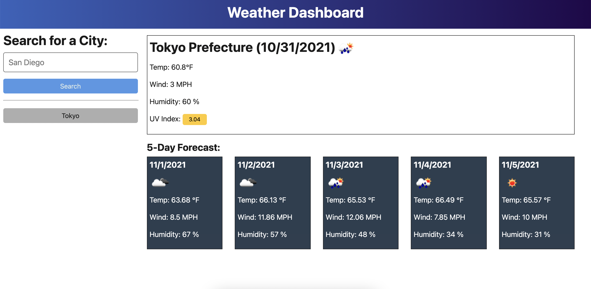

# Weather-Dashboard

This project was for my UCSD coding bootcamp. Learning how to use API's from other sources to display features. 

## Demo & Repository

* [GitHub Repo](https://github.com/latommyla/Weather-Dashboard)
* [GitHub Deployed Live URL](https://latommyla.github.io/Weather-Dashboard/)

## Description

Develop a weather dashboard using API's from [OpenWeather](https://openweathermap.org/api/one-call-api) and using Bootstrap for website layout.

## What was used in this project?

- HTML
- CSS
- JQuery
- Bootstrap
- API's

## Features

- One HTML Page - index.html
- One CSS Page - /assets/style.css
- One Javascript Page - script.js

## Installation

To install this project, simply download the zip file or clone the SSH key to your terminal. GitHub has instructions on how to do this.

## How it works?

- When viewing the deployed application, you will be presented with a search bar to search for any city of your choice.

- Input the city of your choice, then click "Search" button.

- The weather then will be displayed with the temperture, wind speed, and humidity. Also along with the next 5 days.

## Contact 

* [My Gmail](mailto:tommyl.dmd@gmail.com)
* [GitHub](https://github.com/latommyla)
* [Instagram](https://instagram.com/latommyla)